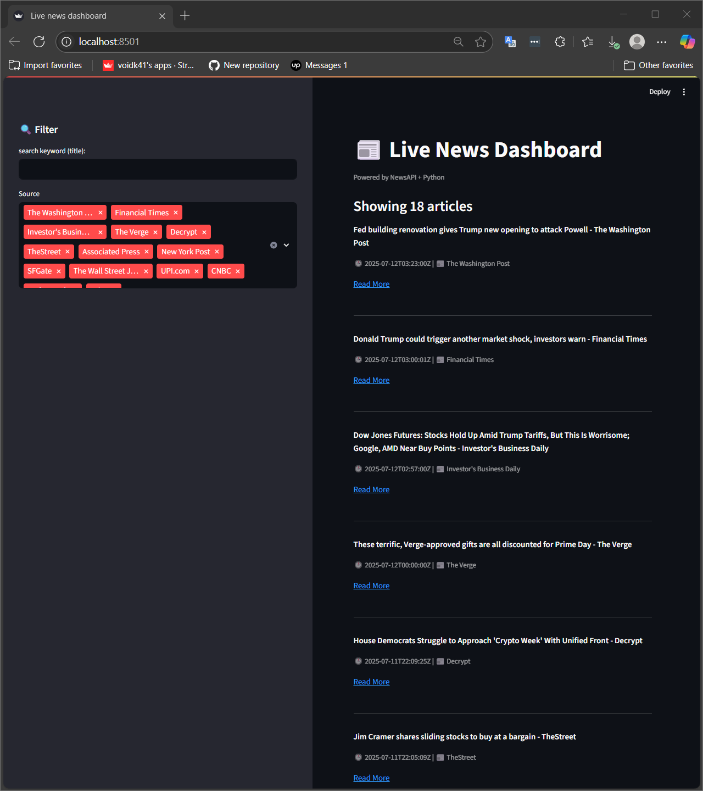

# 📰 Real-Time News Dashboard (Python + NewsAPI + Streamlit)

Welcome to the **Real-Time News Dashboard** — a lightweight but powerful app that fetches the latest news from **NewsAPI.org**, processes and displays them in a **modern Streamlit dashboard**, complete with filters and export features.

---

## 🚀 Overview

This project demonstrates a full pipeline:
- ✅ Fetch real-time news from public API
- ✅ Parse and clean the results
- ✅ Save to local storage
- ✅ Display on an interactive dashboard
- ✅ Export summaries for reporting

Built entirely in **Python**, it shows how to combine simple ETL with real-world API and a friendly UI.

---

## 📦 Tech Stack

| Layer | Tools |
|-------|-------|
| Data Source | [NewsAPI.org](https://newsapi.org) |
| Backend/ETL | `requests`, `pandas`, `logging` |
| Frontend | `streamlit` |
| Storage | `CSV` (can be extended to SQLite) |

---

## 💡 Features

- 🔄 Fetch latest headlines (country: `us`, category: `business`)
- 🧹 Clean and parse raw API response
- 📁 Save as CSV: `output/news.csv`
- 📊 Export summary: total articles per source
- 🖥️ Dashboard UI: filter by title and source
- 📤 Ready to deploy or embed into analytics workflow

---

## 📊 Dashboard Preview

> 📸 Add preview image here like:
>
> 

---

## 🛠️ How to Run

### 1. Clone the repository
```bash
git clone https://github.com/your-username/news-dashboard.git
cd news-dashboard
```

### 2. Install dependencies
```bash
pip install -r requirements.txt
```

### 3. Run the dashboard
```bash
streamlit run dashboard/app.py
```

---

## 📂 Project Structure

```
news_pipeline_project/
├── api/
│   ├── fetch.py         ← fetch from NewsAPI
│   └── parse.py         ← extract + clean
├── storage/
│   ├── save.py          ← save to CSV
│   └── export.py        ← export summary
├── dashboard/
│   └── app.py           ← Streamlit app
├── output/
│   ├── news.csv         ← main data
│   └── news_summary.csv ← source summary
├── main.py
├── README.md
├── requirements.txt
└── .gitignore
```

---

## 🧠 Future Improvements

- [ ] Add SQLite or PostgreSQL support
- [ ] Add filters by publish date
- [ ] Deploy to Streamlit Cloud / Hugging Face Space
- [ ] Auto-fetch via cronjob

---

## 🙌 Acknowledgements

- API by [NewsAPI.org](https://newsapi.org)
- UI powered by [Streamlit](https://streamlit.io)

---

## 👨‍💻 Author

**Khairu Ikramendra**  
💼 *Freelance Dashboard & Data Analytics Developer*  
🔗 [LinkedIn](https://www.linkedin.com/in/khairuikramendra/)  
🔗 [Upwork](https://www.upwork.com/freelancers/~017002e8546494c6e9?mp_source=share)  

---

## 📄 License

MIT License — feel free to use and modify for your own projects.